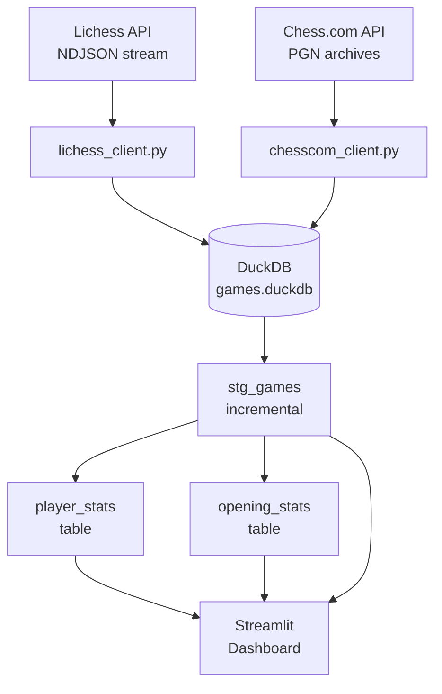
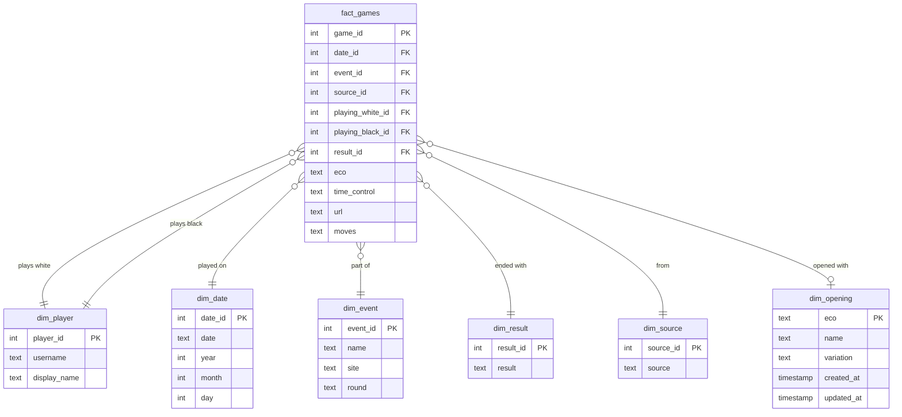

# chessdashboard

CLI tool to fetch chess games from Lichess and Chess.com, store in DuckDB, and analyze with dbt.

## Architecture

### Pipeline



### Database schema



## Install

```bash
uv sync
```

## Configuration

Create a `.env` file in the project root with your usernames:

```bash
LICHESS_USERNAME=your_lichess_username
CHESSCOM_USERNAME=your_chesscom_username
```

The `fetch` command uses these as defaults when `--username` is omitted. The dashboard filters games to these usernames.

## Usage

### Fetch games

```bash
# Fetch from both platforms using .env usernames
uv run chessdashboard fetch

# Fetch from one platform
uv run chessdashboard fetch --platform lichess

# Explicit username and limit
uv run chessdashboard fetch -u <username> --platform lichess --max 50
```

### List stored games

```bash
uv run chessdashboard list
uv run chessdashboard list --platform lichess
```

### Launch dashboard

```bash
# Requires dbt models: cd chessdashboard_dbt && uv run dbt run
uv run chessdashboard dashboard

# Custom port
uv run chessdashboard dashboard --port 8080
```

## dbt Usage

The dbt project transforms raw game data into analytics-ready models.

```bash
cd chessdashboard_dbt

# Run all models
uv run dbt run

# Run tests
uv run dbt test

# Run both
uv run dbt build
```

### Models

- **stg_games**: Denormalized view of all games with dimensions joined
- **player_stats**: Win/loss/draw statistics per player and source
- **opening_stats**: Performance statistics by ECO opening code and source
