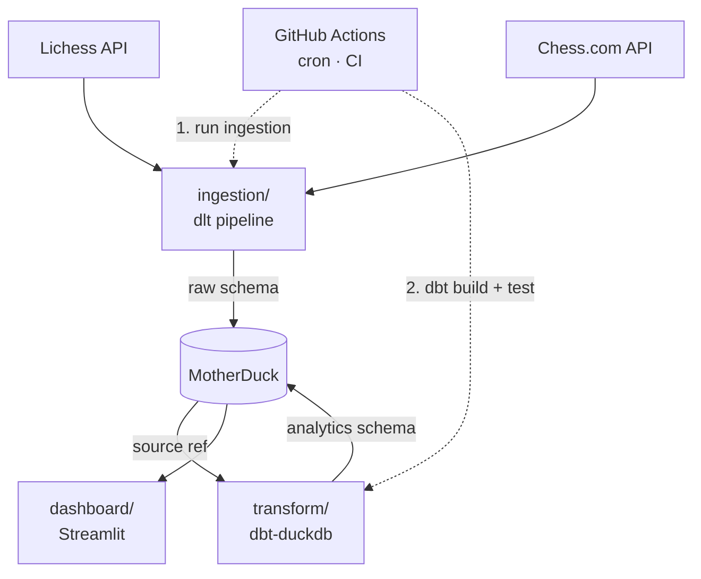

# chessdashboard

Cloud-native analytics pipeline for chess games from Lichess and Chess.com. Fetches games via public APIs, loads raw data into [MotherDuck](https://motherduck.com/) (cloud DuckDB), transforms with [dbt](https://www.getdbt.com/), and visualizes in a [Streamlit](https://streamlit.io/) dashboard.

**Live dashboard:** [rbrtrss-chessdashboard.streamlit.app](https://rbrtrss-chessdashboard.streamlit.app/)

## Architecture


```mermaid
flowchart TD
    LI[Lichess API] --> ING
    CC[Chess.com API] --> ING
    ING["ingestion/<br/>dlt pipeline"] -->|raw schema| MD[(MotherDuck)]
    MD -->|source ref| DBT["transform/<br/>dbt-duckdb"]
    DBT -->|analytics schema| MD
    MD --> DASH["dashboard/<br/>Streamlit"]
    GHA["GitHub Actions<br/>cron · CI"] -.->|1. run ingestion| ING
    GHA -.->|2. dbt build + test| DBT
```

The pipeline has three decoupled layers that communicate through MotherDuck schemas:

| Layer | Directory | Responsibility |
|---|---|---|
| **Extract & Load** | `ingestion/` | Fetch games from Lichess (NDJSON) and Chess.com (PGN archives), parse into a common schema, load into MotherDuck `raw.games` |
| **Transform** | `transform/` | dbt project: staging model deduplicates and normalizes, mart models compute daily results, opening stats by color, and a central fact table |
| **Visualize** | `dashboard/` | Streamlit app reading directly from MotherDuck `analytics` schema |

Orchestration runs on GitHub Actions: a daily cron triggers ingestion followed by `dbt build`, and a CI workflow runs lint + tests on every PR.

## Repository structure

```
chessdashboard/
├── ingestion/
│   ├── sources/
│   │   ├── lichess.py            # Custom dlt resource — NDJSON stream
│   │   └── chesscom.py           # Wraps dlt verified Chess.com source
│   ├── normalizers/
│   │   └── common.py             # Maps both sources → common schema
│   ├── pipeline.py               # dlt pipeline entry point (CLI)
│   └── config.py                 # Env vars (MOTHERDUCK_TOKEN, usernames)
│
├── transform/                    # dbt project root
│   ├── dbt_project.yml
│   ├── profiles.yml              # MotherDuck connection via env var
│   ├── seeds/
│   │   └── eco_codes.csv         # ECO opening codes (A00–E99)
│   ├── models/
│   │   ├── staging/
│   │   │   ├── _stg_sources.yml  # Source definition → raw schema
│   │   │   ├── _stg_models.yml   # Staging model tests
│   │   │   └── stg_games.sql     # Time control parsing, player perspective
│   │   └── marts/
│   │       ├── _marts_models.yml # Mart model tests
│   │       ├── fct_games.sql     # Fact table — joins stg_games + ECO seed
│   │       ├── daily_results.sql # Daily game counts by result, source, time control
│   │       └── opening_stats.sql # Opening performance by color, source, date
│   ├── tests/
│   └── macros/
│
├── dashboard/
│   └── app.py                    # Streamlit entry point
│
├── .github/workflows/
│   ├── daily_pipeline.yml        # Cron → ingest → dbt build → dbt test
│   └── ci.yml                    # On push: lint, pytest, dbt build --target ci
│
├── tests/                        # pytest for ingestion + loaders
├── pyproject.toml                # uv — all Python dependencies
├── Makefile
├── .env.example
└── README.md
```

## Prerequisites

- Python 3.12+
- [uv](https://docs.astral.sh/uv/) for dependency management
- A [MotherDuck](https://motherduck.com/) account (free tier works)

## Setup

1. **Clone and install dependencies**

```bash
git clone https://github.com/rbrtrss/chessdashboard.git
cd chessdashboard
uv sync
```

2. **Configure environment variables**

```bash
cp .env.example .env
```

Edit `.env` with your credentials:

```
MOTHERDUCK_TOKEN=your_motherduck_token
LICHESS_USERNAME=your_lichess_username
CHESSCOM_USERNAME=your_chesscom_username
DESTINATION=motherduck
```

3. **Create the MotherDuck database**

```bash
make setup
```

## Usage

### Local development

A `Makefile` wraps common commands so local and CI stay in sync:

```bash
# Fetch games from both platforms and load into MotherDuck
make ingest

# Run dbt: staging → marts → tests
make transform

# Launch Streamlit dashboard
make dash
```

### Ingestion CLI

```bash
# Fetch from both platforms (uses .env usernames)
uv run python -m ingestion.pipeline

# Fetch from one platform only
uv run python -m ingestion.pipeline --platform lichess

# Limit number of games fetched
uv run python -m ingestion.pipeline --platform chesscom --max 100
```

The ingestion layer is **idempotent**: games are deduplicated on `game_id` via `write_disposition="merge"` — re-running is always safe. dlt stores incremental state at the destination so only new games are pulled on each run.

### dbt

```bash
cd transform

# Run all models
uv run dbt run

# Run tests
uv run dbt test

# Build (run + test) and generate docs
uv run dbt build
uv run dbt docs generate && uv run dbt docs serve
```

### Dashboard

```bash
uv run streamlit run dashboard/app.py
```

The dashboard connects to MotherDuck using the `MOTHERDUCK_TOKEN` environment variable loaded from `.env`.

## Data model

### Staging

**`stg_games`** — One row per game, with time control parsing and player perspective derived from `LICHESS_USERNAME` / `CHESSCOM_USERNAME` env vars:

| Column | Type | Description |
|---|---|---|
| `game_id` | `VARCHAR` | Unique identifier (source-prefixed) |
| `source` | `VARCHAR` | `lichess` or `chesscom` |
| `played_at` | `TIMESTAMP` | Game start time (UTC) |
| `white_username` | `VARCHAR` | White player's username |
| `black_username` | `VARCHAR` | Black player's username |
| `white_rating` | `INTEGER` | White player's Elo at game time |
| `black_rating` | `INTEGER` | Black player's Elo at game time |
| `result` | `VARCHAR` | Raw game result |
| `eco` | `VARCHAR` | ECO opening code |
| `time_control` | `VARCHAR` | Raw time control string |
| `moves` | `VARCHAR` | Move list |
| `my_color` | `VARCHAR` | `white` or `black` (which side I played) |
| `time_category` | `VARCHAR` | `bullet`, `blitz`, `rapid`, or `classical` |
| `my_result` | `VARCHAR` | `win`, `loss`, or `draw` |
| `my_rating` | `INTEGER` | My Elo at game time |
| `opponent_rating` | `INTEGER` | Opponent Elo at game time |

### Marts

- **`fct_games`** — Central fact table joining `stg_games` with `eco_codes` seed for opening names, variants, player rating, and opponent strength classification
- **`daily_results`** — Daily game counts grouped by result, source, and time category; drives the results-over-time chart
- **`opening_stats`** — Opening performance by ECO code, color, source, and date: games played, wins, losses, draws, and win rate; drives the opening donut charts

## CI/CD

### Daily pipeline (`.github/workflows/daily_pipeline.yml`)

Runs on cron at 06:00 UTC:

1. Install dependencies with `uv sync`
2. Run ingestion (`make ingest`)
3. Run `dbt build` (models + tests)
4. Fail the workflow if any dbt test fails

### CI (`.github/workflows/ci.yml`)

Runs on every push to `main`:

1. Lint with `ruff`
2. Run `pytest` for ingestion unit tests
3. Run dbt unit tests (`dbt test --select test_type:unit --target ci`) against a local DuckDB

## Deployment

### Dashboard on Streamlit Community Cloud

1. Push the repo to GitHub
2. Go to [share.streamlit.io](https://share.streamlit.io) → **New app**
3. Set the main file path to `dashboard/app.py`
4. Under **Advanced settings → Secrets**, add:

```toml
MOTHERDUCK_TOKEN = "your_motherduck_token"
LICHESS_USERNAME = "your_lichess_username"
CHESSCOM_USERNAME = "your_chesscom_username"
```

### GitHub Actions secrets

Add these repository secrets for the CI/CD workflows:

| Secret | Description |
|---|---|
| `MOTHERDUCK_TOKEN` | MotherDuck API token |
| `LICHESS_USERNAME` | Lichess username for ingestion |
| `CHESSCOM_USERNAME` | Chess.com username for ingestion |

## Stack

| Component | Tool | Why |
|---|---|---|
| Warehouse | MotherDuck | Serverless cloud DuckDB — zero infra, SQL-native, generous free tier |
| Transform | dbt-duckdb | Industry-standard transform layer with testing, docs, and lineage |
| Dashboard | Streamlit | Python-native, fast to build, free cloud hosting |
| Orchestration | GitHub Actions | Already in the repo, no extra service to manage |
| Dependencies | uv | Fast, reproducible Python dependency management |
| CI | ruff + pytest + dbt test | Lint, unit tests, and data quality in one pipeline |

## TODO

### 1. Setup & Configuration

- ~~1.1 Copy `.env.example` → `.env` and fill in credentials (`MOTHERDUCK_TOKEN`, `LICHESS_USERNAME`, `CHESSCOM_USERNAME`)~~ ✓ done
- ~~1.2 Create MotherDuck database and schemas (`chessdashboard.raw`, `chessdashboard.analytics`)~~ ✓ done

### 2. Ingestion Layer (`ingestion/`)

- ~~2.1 `config.py` — env var loading~~ ✓ done
- ~~2.2 `sources/lichess.py` — custom dlt resource (NDJSON stream)~~ ✓ done
- ~~2.3 `sources/chesscom.py` — wraps dlt verified Chess.com source~~ ✓ done
- ~~2.4 `normalizers/common.py` — normalize both sources to common schema~~ ✓ done
- ~~2.5 loaders — replaced by dlt `write_disposition="merge"` + destination config~~ ✓ done
- ~~2.6 `pipeline.py` — CLI entry point with `--platform` and `--max` flags~~ ✓ done

### 3. Transform Layer (`transform/`)

- ~~3.1 `dbt_project.yml` — dbt project config~~ ✓ done
- ~~3.2 `profiles.yml` — MotherDuck connection via env var~~ ✓ done
- ~~3.3 `models/staging/_stg_sources.yml` — source definition pointing to `raw` schema~~ ✓ done
- ~~3.4 `models/staging/stg_games.sql` — dedup, cast, normalize~~ ✓ done
- ~~3.5 `models/marts/daily_results.sql` — daily game counts by result, source, and time category~~ ✓ done
- ~~3.6 `models/marts/opening_stats.sql` — opening performance by color, source, and date~~ ✓ done

### 4. Dashboard Layer (`dashboard/`)

- ~~4.1 `app.py` — Streamlit entry point with filters, Elo chart, results chart, and opening pie charts~~ ✓ done

### 5. Tests (`tests/`)

- ~~5.1 Unit tests for ingestion clients (Lichess, Chess.com)~~ ✓ done
- ~~5.2 Unit tests for normalizers (PGN parser, schema mapping)~~ ✓ done
- ~~5.3 Unit tests for pipeline/loader (build_pipeline, normalized resources, run)~~ ✓ done
- ~~5.4 dbt tests in `transform/tests/`~~ ✓ done

### 6. CI/CD (`.github/workflows/`)

- ~~6.1 `daily_pipeline.yml` — cron at 06:00 UTC: ingest → `dbt build`~~ ✓ done
- ~~6.2 `ci.yml` — on push: `ruff` lint → `pytest` → `dbt build --target ci`~~ ✓ done

### 7. Project Files

- ~~7.1 `pyproject.toml` — all Python dependencies via `uv`~~ ✓ done
- ~~7.2 `Makefile` — `make ingest`, `make transform`, `make dash`~~ ✓ done
- ~~7.3 `.env.example` — template with required env vars~~ ✓ done

### 8. Deployment

- ~~8.1 Add GitHub Actions secrets (`MOTHERDUCK_TOKEN`, `LICHESS_USERNAME`, `CHESSCOM_USERNAME`)~~ ✓ done
- ~~8.2 Deploy dashboard to Streamlit Community Cloud~~ ✓ done

## License

MIT
